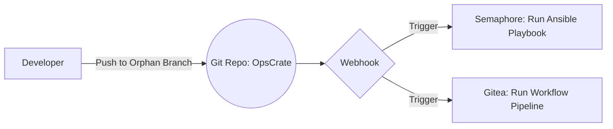
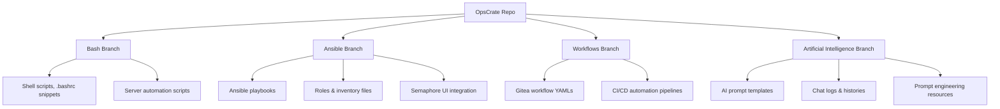

# OpsCrate: Your Unified GitOps Toolbox

[]()
[]()
[]()
[]()

OpsCrate is a centralized GitOps repository designed to manage multiple aspects of infrastructure and automation in isolated orphan branches. It combines Bash scripts, Ansible playbooks, CI/CD workflows, and AI prompt engineering into a single declarative source-of-truth, enabling real-time synchronization and control over your server environments and automation pipelines.

This repo embraces a multi-branch strategy where each orphan branch contains focused resources—ranging from shell scripts to AI content—allowing granular versioning and deployment of distinct service domains independently.

---

## Table of Contents <a id="table-of-contents"></a>

- [Project Overview](#project-overview)
- [Repository Structure](#repository-structure)
- [Branch Management & Workflow](#branch-management--workflow)
- [Detailed Branch Content](#detailed-branch-content)
- [Working Process & Automation](#working-process--automation)
- [Best Practices & Security](#best-practices--security)
- [FAQ & Troubleshooting](#faq--troubleshooting)

---

## Project Overview <a id="project-overview"></a>

OpsCrate functions as an all-in-one resource hub for DevOps engineers managing heterogeneous environments. It tracks and runs:

- Bash configurations and scripts for server maintenance and automation
- Ansible playbooks and inventory management via Semaphore UI
- GitOps-driven workflows orchestrated by Gitea webhooks
- AI-related assets including prompt libraries and chat histories for prompt engineering

The `main` branch serves as a lightweight entry point, containing only this README. All functional content is modularized into dedicated orphan branches to isolate concerns and simplify operational control.

---

## Repository Structure <a id="repository-structure"></a>

The repo uses multiple orphan branches; notable ones include:

| Branch                    | Description                                                                           |
| ------------------------- | ------------------------------------------------------------------------------------- |
| `bash`                    | Shell scripts, `.bashrc` snippets, utilities, and custom automation scripts           |
| `ansible`                 | Ansible playbooks, roles, and inventory files managed and triggered through Semaphore |
| `workflows`               | Gitea workflow YAML files for CI/CD automation                                        |
| `artificial-intelligence` | AI prompt templates, chat logs, and prompt engineering resources                      |

Each branch is designed to be cloned independently and managed separately, enabling precise updates and rollback.

---

## Branch Management & Workflow <a id="branch-management--workflow"></a>

OpsCrate employs a manual branch checkout model supplemented by an alias `pullall` that automates fetching, pruning, and updating all branches with fast-forward merges where possible.

The alias script:

- Fetches all remote branches and prunes deleted ones locally
- Checks branch divergence and fast-forwards when safe
- Creates missing local branches tracking origin automatically

Workflow triggers for Ansible and workflows happen via Gitea webhooks assigned to each branch, enabling event-driven automation pipelines.



---

## Detailed Branch Content <a id="detailed-branch-content"></a>



### Bash Branch

Contains shell scripts for system configuration, server health checks, and environment setups. Scripts are primarily Bash language and designed for idempotent execution on target servers.

### Ansible Branch

Hosts declarative Ansible playbooks, roles, and inventory files. These resources integrate tightly with Semaphore UI, where playbooks are executed and monitored. Proper YAML syntax and inventory structure are prerequisites for smooth runs.

### Workflows Branch

Includes YAML definitions for Gitea workflows controlling CI/CD tasks. These are automatically triggered on branch updates via webhooks.

### Artificial Intelligence Branch

Stores tested AI prompt sets, chat logs, and other prompt engineering resources. Useful for enhancing automation with AI-driven scripts or models.

---

## Working Process & Automation <a id="working-process--automation"></a>

- Users clone OpsCrate and switch between orphan branches manually for targeted updates.
- The `pullall` alias keeps local branches synchronized with remote efficiently.
- Gitea webhooks detect pushes and automatically trigger Semaphore or workflow pipelines.
- All branches maintain declarative content ensuring the current repo state reflects the live environment.

### `pullall` alias for branch sync

```bash
alias pullall='
git fetch --prune --all && \
current_branch=$(git branch --show-current); \
for local_branch in $(git branch --format="%(refname:short)"); do \
  if ! git show-ref --verify --quiet refs/remotes/origin/$local_branch; then \
    echo "🧹 Deleting local branch $local_branch (no longer exists on origin)..."; \
    git branch -D $local_branch; \
  fi; \
done; \
for remote_branch in $(git branch -r | grep -v "\->" | sed "s|origin/||"); do \
  if git show-ref --verify --quiet refs/heads/$remote_branch; then \
    echo "🔍 Checking branch $remote_branch (already exists locally)..."; \
    ahead=$(git rev-list --left-right --count $remote_branch...origin/$remote_branch | awk "{print \$1}"); \
    behind=$(git rev-list --left-right --count $remote_branch...origin/$remote_branch | awk "{print \$2}"); \
    if [ "$ahead" = "0" ] && [ "$behind" != "0" ]; then \
      echo "  ⏩ Fast-forwarding $remote_branch..."; \
      git update-ref refs/heads/$remote_branch refs/remotes/origin/$remote_branch; \
    elif [ "$ahead" = "0" ] && [ "$behind" = "0" ]; then \
      echo "  ✅ $remote_branch is already up-to-date."; \
    else \
      echo "  ⚠️ $remote_branch has diverged! Needs manual pull/merge."; \
    fi; \
  else \
    echo "🌱 Creating missing local branch $remote_branch tracking origin/$remote_branch..."; \
    git branch $remote_branch origin/$remote_branch; \
  fi; \
done; \
git checkout $current_branch'
```

---

## Best Practices & Security <a id="best-practices--security"></a>

- **Keep secrets out of this repository.** Use environment variables or secret management tools instead.
- **Regularly prune obsolete branches** using the provided alias to avoid local clutter and confusion.
- **Use branch protections** on orphan branches to prevent accidental forced pushes.
- **Validate YAML and script syntax** locally before pushing to avoid pipeline failures.
- **Audit webhook configurations** in Gitea and Semaphore regularly to maintain secure triggers.
- **Maintain idempotency** in scripts and playbooks to ensure safe repeated execution.

---

## FAQ & Troubleshooting <a id="faq--troubleshooting"></a>

| Issue                             | Cause                                  | Solution                                     |
| --------------------------------- | -------------------------------------- | -------------------------------------------- |
| Branch divergence warning         | Local branch has commits not on remote | Pull and merge manually before push          |
| Semaphore playbook fails          | Invalid inventory or syntax error      | Validate playbook with `ansible-lint`        |
| Workflow not triggered by webhook | Webhook URL misconfigured or disabled  | Verify Gitea webhook settings                |
| AI prompt files outdated          | Manual updates needed                  | Pull latest `artificial-intelligence` branch |

---

OpsCrate — the comprehensive GitOps repository that unifies your DevOps, automation, and AI content management under one roof!

---

[⬆️ Back to Top](#table-of-contents)
**THIS REPOSITORY IS ENCRYPTED. IF YOU'RE HERE, YOU'RE EITHER VERY BRAVE OR VERY LOST. EITHER WAY, GOOD LUCK!**
